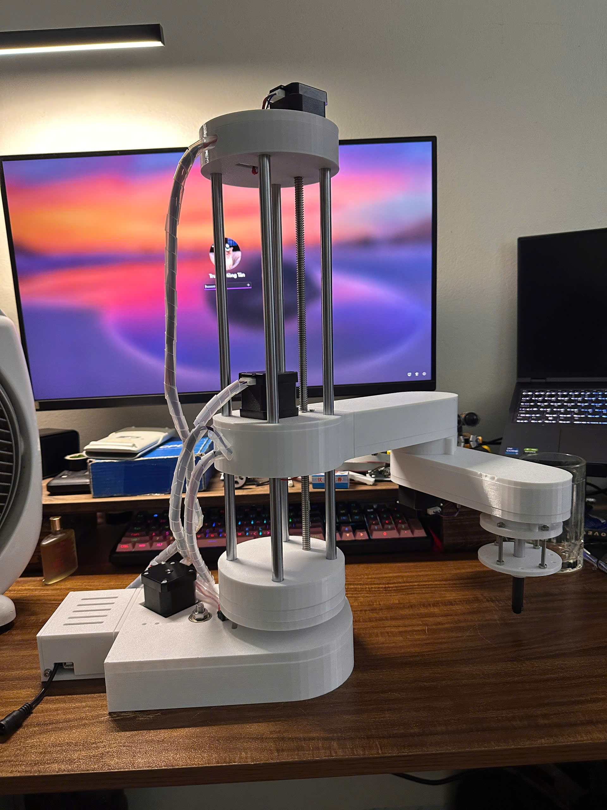

# 4DOF SCARA Robot 🤖🖋️

## 📖 Project Overview
This repository contains the hardware design, 3D models, and firmware for a 4-Degree-of-Freedom (4DOF) SCARA (Selective Compliance Assembly Robot Arm). Built primarily with custom 3D-printed components, stepper motors, and linear motion rods, this robotic arm is highly stable and precise. 

It is currently configured as a robotic pen plotter, capable of executing complex drawing and writing tasks by converting digital text/images into physical movements using inverse kinematics.

## ✨ Key Features
* **Degrees of Freedom:** 4-axis movement (X, Y for the articulated arm, Z for vertical translation, and rotation at the end-effector).
* **Mechanical Structure:** Robust 3D-printed chassis utilizing smooth steel rods and a leadscrew for stable Z-axis elevation.
* **Actuation:** Driven by stepper motors (e.g., NEMA 17) to ensure high-precision positioning and smooth trajectories.
* **Application:** Pen plotting, writing, and potential for light pick-and-place operations.

## 🛠️ Hardware Components
* Custom 3D Printed Parts (Base, Links, Joints, and End-effector)
* Stepper Motors (NEMA 17)
* Linear Motion: Smooth rods, linear bearings, and a leadscrew
* Control Board: [Insert your controller here, e.g., Arduino Mega + RAMPS 1.4 / CNC Shield]
* End-Effector: Custom pen holder with spring mechanism (for uniform writing pressure)

## 🎨 Demonstration
Here is a writing sample demonstrating the accuracy and repeatability of the SCARA robot. The arm perfectly translates coordinates to write text.

**Plotting Result:**

## 🚀 Setup & Usage
1. **Mechanical Assembly:** Print the STL files provided in the `[3D_Models]` folder and assemble the mechanical parts using M3/M4 screws and linear rods.
2. **Electronics:** Connect the stepper motors and endstops to the control board following the wiring diagram.
3. **Firmware:** Flash the provided firmware (or standard CNC firmware like Marlin/Grbl tailored for SCARA kinematics) to the microcontroller.
4. **Software:** Use a G-code sender software to stream plotting coordinates to the robot.

## 🔮 Future Improvements
* Design an interchangeable toolhead (e.g., suction cup, mechanical gripper).
* Optimize the inverse kinematics algorithm for faster and smoother curves.
* Develop a custom GUI or web interface for real-time control.
